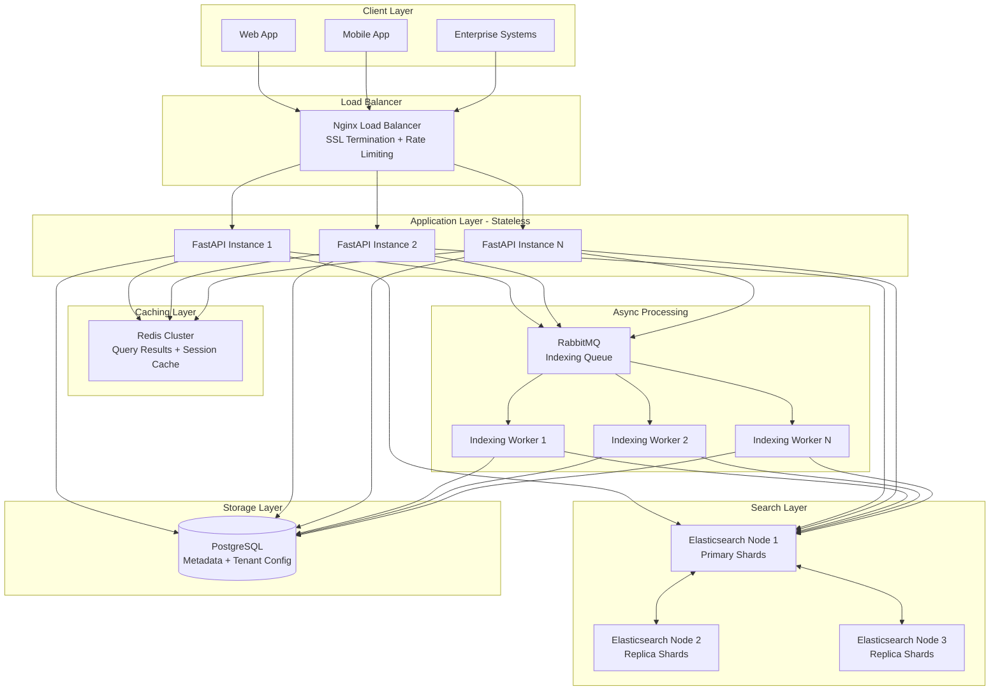
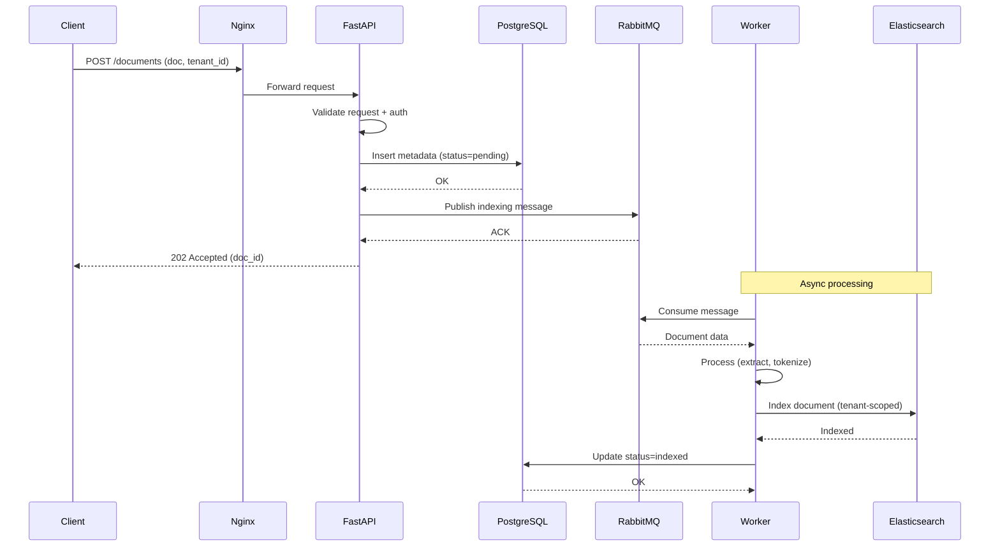
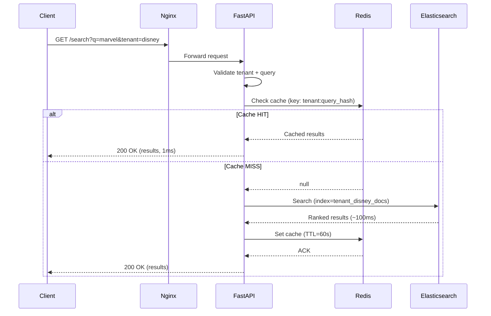
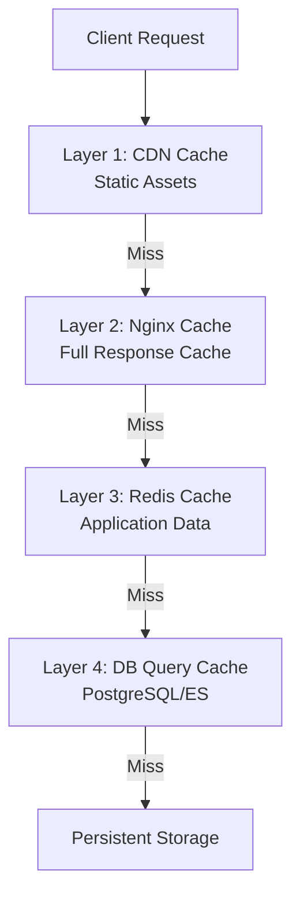
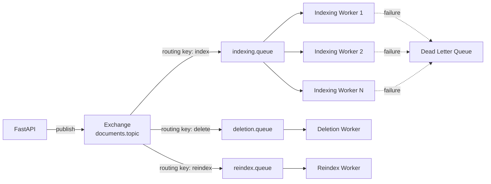
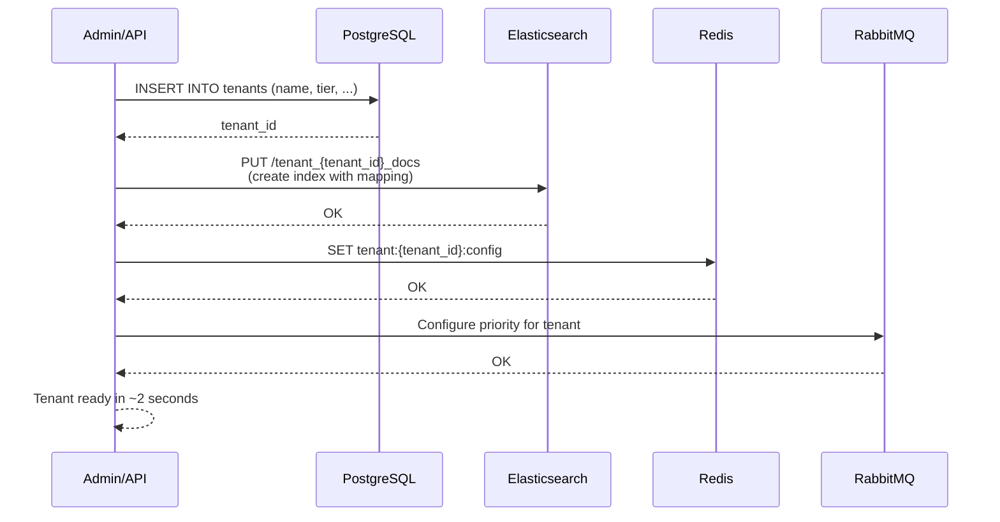
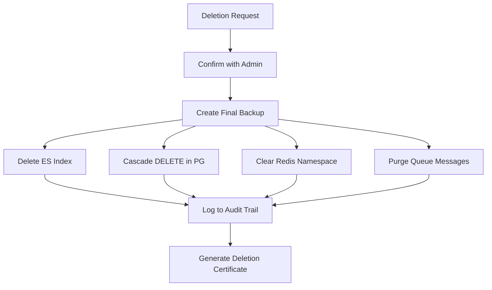

# Architecture Design Document
## Distributed Document Search Service

**Author:** Shanmukha Raj  
**Date:** July 2026  
**Version:** 1.0  

---

## 1. Overview

This document outlines the architecture of a **Distributed Document Search Service** designed to search through **10+ million documents** across multiple tenants with **sub-500ms response times** at the 95th percentile.

The system is designed to demonstrate enterprise-grade patterns including:
- **Multi-tenancy** with strict data isolation
- **Horizontal scalability** to handle growing document volumes
- **Fault tolerance** through redundancy and graceful degradation
- **High throughput** supporting 1000+ concurrent searches per second

---

## 2. System Requirements

### 2.1 Functional Requirements
- Index new documents via REST API
- Search documents with full-text search and relevance ranking
- Retrieve document details by ID
- Delete documents by ID
- Enforce tenant isolation for all operations

### 2.2 Non-Functional Requirements
| Requirement | Target |
|---|---|
| Document volume | 10+ million |
| Search latency (p95) | < 500ms |
| Throughput | 1000+ concurrent searches/sec |
| Availability | 99.95% |
| Multi-tenancy | Strict data isolation |
| Scalability | Horizontal (scale-out) |

### 2.3 Assumptions
- Documents are text-based (contracts, reports, articles, emails)
- Average document size: 10KB - 100KB
- Read-heavy workload (100 searches : 1 upload)
- Tenants are enterprise customers with 10K - 1M documents each

---
## 3. High-Level System Architecture

The system follows a **layered microservices architecture** with clear separation of concerns. Each layer can be scaled independently based on load.

### 3.1 Architecture Diagram



### 3.2 Component Responsibilities

| Component | Responsibility | Technology Choice |
|---|---|---|
| **Load Balancer** | Distributes traffic, SSL termination, rate limiting | Nginx |
| **API Layer** | Request handling, validation, authentication, orchestration | FastAPI (Python) |
| **Caching Layer** | Query result caching, session management | Redis |
| **Search Engine** | Full-text search with relevance ranking | Elasticsearch |
| **Metadata Store** | Source of truth for documents and tenant config | PostgreSQL |
| **Message Queue** | Async task processing (indexing, deletion) | RabbitMQ |
| **Workers** | Background document processing and indexing | Python (Celery) |

### 3.3 Why This Architecture?

**Stateless Application Layer**  
API servers don't store state → any request can go to any instance → easy horizontal scaling. Add more instances as traffic grows.

**Separation of Read and Write Paths**  
Read path: `API → Redis → Elasticsearch` (optimized for sub-500ms search).  
Write path: `API → RabbitMQ → Worker → Elasticsearch + PostgreSQL` (async, non-blocking).

**Independent Scaling**  
- If search traffic spikes → add more FastAPI instances and ES nodes
- If indexing backlog grows → add more workers
- If cache misses increase → add more Redis nodes

**Fault Isolation**  
If Redis crashes, the system falls back to Elasticsearch (slower but functional). If RabbitMQ crashes, uploads queue up but existing searches continue.

---
## 4. Data Flow Diagrams

The system has two primary data flows: **indexing** (write path) and **searching** (read path). Each is optimized differently — indexing prioritizes throughput via async processing, while searching prioritizes latency via caching.

### 4.1 Indexing Flow (Document Upload)

When a client uploads a document, the request is acknowledged immediately, and actual indexing happens asynchronously in the background.



**Design Rationale:**
- **Async processing** decouples upload from indexing → fast client response (<50ms)
- **PostgreSQL first** ensures we never lose a document even if RabbitMQ fails
- **Worker retries** handle transient failures (e.g., ES node restart)
- **Status tracking** allows clients to poll or subscribe to indexing completion

**Trade-off:** Documents are not immediately searchable (eventual consistency). Typical delay: 1–5 seconds. For our use case (enterprise document search), this is acceptable.

---

### 4.2 Search Flow (Query Documents)

Search requests follow the **cache-aside pattern** — check cache first, fall back to Elasticsearch, then populate cache.



**Design Rationale:**
- **Cache-aside pattern** — application controls cache logic, avoids stale writes
- **TTL of 60 seconds** — balances freshness vs cache hit ratio
- **Cache key includes tenant_id** — prevents cross-tenant data leakage
- **Query hash used as cache key** — normalizes similar queries (e.g., "MARVEL" and "marvel")

**Performance Characteristics:**
| Path | Latency (p95) | Frequency |
|---|---|---|
| Cache HIT | ~1ms | 70-80% of queries |
| Cache MISS | ~150ms | 20-30% of queries |

With a 70% cache hit ratio, the overall p95 latency stays well under 500ms.

---
## 5. Database and Storage Strategy

The system uses a **polyglot persistence** approach — different databases optimized for different workloads. This section explains each choice, alternatives considered, and trade-offs.

### 5.1 Storage Overview

| Layer | Technology | Purpose | Data Stored |
|---|---|---|---|
| **Search Engine** | Elasticsearch 8.x | Full-text search with relevance ranking | Indexed document content, metadata |
| **Metadata Store** | PostgreSQL 15+ | Source of truth, ACID guarantees | Document metadata, tenant config, audit logs |
| **Cache** | Redis 7.x | Low-latency temporary storage | Query results, rate limit counters, sessions |

### 5.2 Why Elasticsearch for Search?

**Chosen because:**
- **Built for scale**: Handles billions of documents with horizontal sharding
- **Sub-100ms latency**: Inverted index architecture designed for fast text search
- **Relevance ranking**: BM25 algorithm out of the box for ranked results
- **Distributed by design**: Automatic sharding and replication across nodes
- **Rich query DSL**: Supports fuzzy search, faceted search, highlighting, aggregations

**Alternatives considered:**

| Alternative | Why We Didn't Choose It |
|---|---|
| **PostgreSQL Full-Text Search (FTS)** | Great up to ~1M docs, but degrades at 10M+ scale. Lacks distributed sharding. |
| **MongoDB Atlas Search** | Vendor lock-in, less flexible query DSL, higher cost at scale |
| **Apache Solr** | Older technology, smaller community, more complex operations |
| **Meilisearch / Typesense** | Excellent for small-to-medium scale, but not proven at 10M+ documents with multi-tenancy |

**Elasticsearch Cluster Configuration:**
- **3 master-eligible nodes** for cluster coordination (quorum)
- **6+ data nodes** with primary + replica shards
- **Sharding**: One index per tenant (or hash-based sharding for very small tenants)
- **Replication factor**: 2 (each shard has 2 replicas for fault tolerance)

### 5.3 Why PostgreSQL for Metadata?

**Chosen because:**
- **ACID transactions**: Guarantees data integrity for critical operations
- **Rich relational model**: Supports complex tenant configurations and audit logs
- **Battle-tested at scale**: Runs mission-critical workloads at companies like Instagram, Reddit
- **Strong consistency**: Source of truth for document existence
- **JSONB support**: Flexible schema for tenant-specific configuration

**What we store:**
```sql
-- Simplified schema
CREATE TABLE documents (
    id UUID PRIMARY KEY,
    tenant_id UUID NOT NULL,
    title VARCHAR(500),
    file_path TEXT,
    status VARCHAR(20),  -- pending, indexed, deleted
    created_at TIMESTAMP,
    updated_at TIMESTAMP,
    metadata JSONB,
    INDEX idx_tenant_status (tenant_id, status)
);

CREATE TABLE tenants (
    id UUID PRIMARY KEY,
    name VARCHAR(255),
    plan VARCHAR(50),  -- free, pro, enterprise
    rate_limit INT,
    created_at TIMESTAMP
);
```

**Alternatives considered:**

| Alternative | Why We Didn't Choose It |
|---|---|
| **MongoDB** | Weaker consistency guarantees, schema flexibility not critical here |
| **DynamoDB** | Vendor lock-in (AWS), complex query patterns require careful key design |
| **MySQL** | PostgreSQL has better JSONB support and more advanced features |

### 5.4 Why Redis for Caching?

**Chosen because:**
- **In-memory speed**: Sub-millisecond latency for reads
- **Rich data structures**: Strings, hashes, lists, sorted sets, HyperLogLog
- **Pub/sub support**: Useful for cache invalidation across API instances
- **Cluster mode**: Horizontal scaling with automatic sharding
- **TTL support**: Automatic key expiration for cache management

**What we cache:**
| Cache Type | Key Format | TTL | Purpose |
|---|---|---|---|
| Search results | `search:{tenant_id}:{query_hash}` | 60s | Speed up repeated queries |
| Document metadata | `doc:{tenant_id}:{doc_id}` | 300s | Fast document retrieval |
| Rate limit counters | `ratelimit:{tenant_id}:{minute}` | 60s | Enforce rate limits |
| Tenant config | `tenant:{tenant_id}:config` | 3600s | Avoid PostgreSQL hits for config |

**Alternatives considered:**

| Alternative | Why We Didn't Choose It |
|---|---|
| **Memcached** | Simpler but lacks data structures and persistence |
| **In-memory (Python dict)** | Doesn't work with multiple API instances (each has its own cache) |
| **Hazelcast** | Enterprise-focused, higher operational complexity |

### 5.5 Data Partitioning Strategy

**Approach: Index-per-Tenant in Elasticsearch**

Each tenant gets a dedicated Elasticsearch index:
```
tenant_disney_docs
tenant_netflix_docs
tenant_spotify_docs
```

**Benefits:**
- **Strict isolation**: Impossible to accidentally query across tenants
- **Independent scaling**: Hot tenants can have more shards
- **Independent lifecycle**: Delete a tenant = delete their index (easy compliance)
- **Custom mappings**: Different tenants can have different schemas if needed

**Considerations:**
- **Small tenants**: For tenants with <10K docs, we can group them into shared indices (`shared_index_1`, `shared_index_2`) using tenant_id as a filter to avoid too many small indices
- **Very large tenants**: For tenants with >10M docs, we can shard their index across multiple ES nodes using routing keys

**PostgreSQL: Row-Level Multi-Tenancy**  
All tenants share the same tables but every row has a `tenant_id` column. Queries always include `WHERE tenant_id = ?`. This is enforced at the application layer and by Row-Level Security policies.

**Redis: Namespaced Keys**  
All Redis keys are prefixed with tenant_id (e.g., `search:tenant_disney:query_hash`). This prevents key collisions and enables per-tenant cache management.

---
## 6. API Design

The API follows **RESTful principles** with clear, resource-oriented URLs. All requests use **JSON** for payloads and standard HTTP status codes for responses.

### 6.1 Design Principles

- **Resource-oriented URLs**: `/documents/{id}` instead of `/getDocument`
- **Standard HTTP verbs**: GET (read), POST (create), DELETE (remove)
- **JSON everywhere**: Request bodies and responses use JSON
- **Header-based multi-tenancy**: `X-Tenant-ID` header identifies the tenant
- **Explicit error responses**: Structured error payloads with codes and messages
- **Versioned APIs**: All endpoints prefixed with `/v1/` for backward compatibility
- **Idempotent operations**: DELETE and PUT are safely repeatable

### 6.2 Authentication & Multi-Tenancy

Every request must include:
```
Authorization: Bearer <API_KEY>
X-Tenant-ID: <TENANT_UUID>
```

The API validates the API key against the tenant, ensuring:
- The key exists and is active
- The key belongs to the tenant specified in `X-Tenant-ID`
- The tenant has not exceeded its rate limit

### 6.3 API Endpoints

#### 6.3.1 Index a Document

**Endpoint:** `POST /v1/documents`

**Purpose:** Submit a document for indexing. Returns immediately with a document ID; actual indexing happens asynchronously.

**Request:**
```http
POST /v1/documents
Authorization: Bearer sk_live_abc123
X-Tenant-ID: tenant_disney_corp
Content-Type: application/json

{
  "title": "Marvel Studios Q3 2024 Contract",
  "content": "This agreement between Marvel Studios and...",
  "metadata": {
    "author": "Legal Team",
    "tags": ["contract", "marvel", "2024"],
    "department": "Legal"
  }
}
```

**Response (202 Accepted):**
```json
{
  "document_id": "doc_7f3e9b2a-4c1d-4a8e-9f2b-1c3d5e7f9a0b",
  "status": "pending",
  "message": "Document accepted for indexing",
  "estimated_indexing_time_seconds": 3
}
```

**Error Responses:**
- `400 Bad Request` — Missing required fields
- `401 Unauthorized` — Invalid API key
- `403 Forbidden` — Tenant not allowed
- `413 Payload Too Large` — Document > 10MB
- `429 Too Many Requests` — Rate limit exceeded

---

#### 6.3.2 Search Documents

**Endpoint:** `GET /v1/search`

**Purpose:** Full-text search across the tenant's documents with relevance ranking.

**Request:**
```http
GET /v1/search?q=marvel+contract&limit=10&offset=0
Authorization: Bearer sk_live_abc123
X-Tenant-ID: tenant_disney_corp
```

**Query Parameters:**
| Parameter | Type | Required | Default | Description |
|---|---|---|---|---|
| `q` | string | Yes | — | Search query |
| `limit` | int | No | 10 | Max results (max 100) |
| `offset` | int | No | 0 | Pagination offset |
| `sort` | string | No | `relevance` | `relevance`, `date_desc`, `date_asc` |
| `filter` | string | No | — | JSON filter (e.g., `{"tags":["contract"]}`) |

**Response (200 OK):**
```json
{
  "total": 42,
  "limit": 10,
  "offset": 0,
  "took_ms": 87,
  "cached": false,
  "results": [
    {
      "document_id": "doc_7f3e9b2a-4c1d-4a8e-9f2b-1c3d5e7f9a0b",
      "title": "Marvel Studios Q3 2024 Contract",
      "snippet": "This agreement between <em>Marvel</em> Studios and Disney Corp regarding the <em>contract</em>...",
      "score": 8.42,
      "metadata": {
        "author": "Legal Team",
        "tags": ["contract", "marvel", "2024"]
      },
      "created_at": "2024-09-15T10:30:00Z"
    }
  ]
}
```

**Error Responses:**
- `400 Bad Request` — Invalid query syntax
- `401 Unauthorized` — Invalid API key
- `429 Too Many Requests` — Rate limit exceeded

---

#### 6.3.3 Retrieve Document Details

**Endpoint:** `GET /v1/documents/{document_id}`

**Purpose:** Fetch full details of a specific document.

**Request:**
```http
GET /v1/documents/doc_7f3e9b2a-4c1d-4a8e-9f2b-1c3d5e7f9a0b
Authorization: Bearer sk_live_abc123
X-Tenant-ID: tenant_disney_corp
```

**Response (200 OK):**
```json
{
  "document_id": "doc_7f3e9b2a-4c1d-4a8e-9f2b-1c3d5e7f9a0b",
  "title": "Marvel Studios Q3 2024 Contract",
  "content": "This agreement between Marvel Studios and Disney Corp...",
  "metadata": {
    "author": "Legal Team",
    "tags": ["contract", "marvel", "2024"],
    "department": "Legal"
  },
  "status": "indexed",
  "created_at": "2024-09-15T10:30:00Z",
  "indexed_at": "2024-09-15T10:30:03Z"
}
```

**Error Responses:**
- `404 Not Found` — Document doesn't exist or belongs to different tenant

---

#### 6.3.4 Delete a Document

**Endpoint:** `DELETE /v1/documents/{document_id}`

**Purpose:** Permanently remove a document from search and storage.

**Request:**
```http
DELETE /v1/documents/doc_7f3e9b2a-4c1d-4a8e-9f2b-1c3d5e7f9a0b
Authorization: Bearer sk_live_abc123
X-Tenant-ID: tenant_disney_corp
```

**Response (204 No Content):**
```
(empty body)
```

**Design Note:** Deletion is soft-delete first (mark as deleted in PostgreSQL, remove from ES), then hard-delete via a background cleanup job after 30 days. This allows for accidental deletion recovery.

**Error Responses:**
- `404 Not Found` — Document doesn't exist
- `403 Forbidden` — Document belongs to different tenant

---

#### 6.3.5 Health Check Endpoints

**Endpoint:** `GET /health`

**Purpose:** Overall system health with dependency status.

**Response (200 OK):**
```json
{
  "status": "healthy",
  "version": "1.0.0",
  "timestamp": "2026-07-01T15:30:00Z",
  "dependencies": {
    "postgresql": {"status": "healthy", "latency_ms": 3},
    "elasticsearch": {"status": "healthy", "latency_ms": 12, "cluster_status": "green"},
    "redis": {"status": "healthy", "latency_ms": 1},
    "rabbitmq": {"status": "healthy", "queue_depth": 42}
  }
}
```

**Response (503 Service Unavailable):**
```json
{
  "status": "degraded",
  "dependencies": {
    "elasticsearch": {"status": "unhealthy", "error": "Connection timeout"}
  }
}
```

**Endpoint:** `GET /health/live` — Kubernetes liveness probe (is the process running?)  
**Endpoint:** `GET /health/ready` — Kubernetes readiness probe (can it serve traffic?)

### 6.4 Error Response Format

All errors follow a consistent structure:

```json
{
  "error": {
    "code": "RATE_LIMIT_EXCEEDED",
    "message": "You have exceeded 100 requests per minute",
    "details": {
      "limit": 100,
      "reset_at": "2026-07-01T15:31:00Z"
    },
    "request_id": "req_a1b2c3d4"
  }
}
```

**Why this format?**
- **`code`**: Machine-readable, stable across versions
- **`message`**: Human-readable for debugging
- **`details`**: Context-specific info
- **`request_id`**: Enables tracing in logs (correlate with server-side)

### 6.5 Rate Limiting

Rate limits are enforced **per tenant**, not per API key. This prevents a single tenant from monopolizing capacity.

**Default limits by tier:**
| Tier | Requests/min | Documents |
|---|---|---|
| Free | 60 | 10,000 |
| Pro | 600 | 100,000 |
| Enterprise | 6,000 | 10,000,000 |

**Rate limit headers** (returned on every response):
```
X-RateLimit-Limit: 600
X-RateLimit-Remaining: 542
X-RateLimit-Reset: 1719852600
```

---
## 7. Caching Strategy

Caching is critical to achieving sub-500ms response times. The system uses a **multi-layer caching approach**, with each layer optimized for different data types and access patterns.

### 7.1 Caching Philosophy

The system follows the **cache-aside pattern** (also called lazy loading) as the primary caching strategy:

1. Check cache first
2. On cache miss, query the underlying data store
3. Populate cache with result
4. Return result to client

**Why cache-aside over write-through?**
- Simpler to implement and reason about
- Only caches actively read data (no waste)
- Cache failures don't block writes
- Works well with our read-heavy workload (100:1 read/write ratio)

### 7.2 Multi-Layer Cache Architecture



### 7.3 Cache Layers Detail

#### Layer 1: CDN Cache (Optional, for Enterprise)
- **Technology:** CloudFront, Cloudflare
- **Caches:** Static assets, downloadable document previews
- **TTL:** 24 hours
- **Invalidation:** On document update, purge specific URLs

#### Layer 2: Nginx Response Cache
- **Technology:** Nginx `proxy_cache`
- **Caches:** Full HTTP responses for GET requests
- **TTL:** 30 seconds
- **Key:** URL + tenant_id header
- **Use case:** Extremely hot queries repeated within seconds

#### Layer 3: Redis Application Cache (Primary)
The main caching layer where most caching logic lives. Redis handles multiple cache types with different strategies.

#### Layer 4: Database Query Cache
- **PostgreSQL:** Shared buffer cache (automatic)
- **Elasticsearch:** Query cache and filter cache (automatic)
- Not directly controlled by application, but influences performance

### 7.4 Redis Cache Design

| Cache Type | Key Pattern | TTL | Eviction | Purpose |
|---|---|---|---|---|
| Search Results | `search:{tenant_id}:{query_hash}` | 60s | LRU | Fast repeat searches |
| Document Metadata | `doc:{tenant_id}:{doc_id}` | 300s | LRU | Speed up document retrieval |
| Tenant Config | `tenant:{tenant_id}:config` | 3600s | LRU | Avoid PG hits for config |
| Rate Limit Counters | `ratelimit:{tenant_id}:{minute}` | 60s | TTL | Enforce API rate limits |
| Aggregations | `agg:{tenant_id}:{type}` | 900s | LRU | Cache expensive aggregations |
| Auth Tokens | `auth:{token_hash}` | 3600s | LRU | Fast auth validation |

### 7.5 Cache Key Design

**Rules for cache keys:**

1. **Always prefix with tenant_id** — prevents cross-tenant data leakage
2. **Use hierarchical namespacing** — enables pattern-based invalidation
3. **Hash long values** — keeps keys under 512 bytes
4. **Include version prefix** — allows cache schema evolution

**Example:**
```python
def build_search_cache_key(tenant_id: str, query: str, filters: dict) -> str:
    query_normalized = query.lower().strip()
    query_hash = hashlib.sha256(
        f"{query_normalized}:{json.dumps(filters, sort_keys=True)}".encode()
    ).hexdigest()[:16]
    return f"v1:search:{tenant_id}:{query_hash}"
```

**Why hash the query?**
- Long queries could exceed key size limits
- Normalizes similar queries (e.g., extra whitespace)
- Prevents special characters from breaking Redis

### 7.6 Cache Invalidation Strategy

The system uses a **hybrid invalidation approach**:

#### Strategy 1: TTL-Based (Default)
Most caches use TTL as the primary expiration mechanism. Chosen for simplicity and predictability.

#### Strategy 2: Explicit Invalidation (Critical Data)
When a document is updated or deleted:
```python
def invalidate_document_cache(tenant_id: str, doc_id: str):
    # Invalidate document metadata cache
    redis.delete(f"v1:doc:{tenant_id}:{doc_id}")
    
    # Invalidate all search caches for this tenant
    # (using pattern-based scan and delete)
    for key in redis.scan_iter(match=f"v1:search:{tenant_id}:*"):
        redis.delete(key)
```

**Note:** Wildcard invalidation is expensive. For high-write tenants, we accept slight staleness in search results.

#### Strategy 3: Event-Driven Invalidation (Cross-Instance)
For multi-instance API deployments, we use **Redis Pub/Sub** to notify all instances of cache invalidation events:
```
Instance A updates doc → publishes "invalidate:doc_123" event
Instance B, C, D receive event → delete local caches
```

### 7.7 Cache Warming Strategies

**Cold Start Problem:** Right after deployment, cache is empty → all requests hit database → slow initial responses.

**Solutions:**

1. **Pre-warming on Startup**
   - Background job loads top 1000 most-searched queries into cache on service start
   - Trades startup time for consistent latency

2. **Predictive Warming**
   - Analyze search patterns nightly
   - Pre-cache trending queries during off-peak hours

3. **Refresh-Ahead for Hot Keys**
   - Popular queries (top 100) auto-refresh 10 seconds before TTL expires
   - Prevents "thundering herd" when popular caches expire simultaneously

### 7.8 Handling Cache Failures

**What happens if Redis is down?**

The system implements **graceful degradation**:

```python
def get_search_results(tenant_id: str, query: str):
    try:
        # Try cache first
        cached = redis_client.get(cache_key)
        if cached:
            return cached
    except RedisConnectionError:
        # Log but don't fail — Redis is optional
        logger.warning("Redis unavailable, falling back to ES")
    
    # Query Elasticsearch (fallback)
    results = elasticsearch.search(query)
    
    try:
        # Try to populate cache (don't fail if this fails)
        redis_client.setex(cache_key, 60, results)
    except RedisConnectionError:
        pass
    
    return results
```

**Behavior when Redis is down:**
- Search still works, just slower (100ms vs 1ms)
- No errors returned to client
- Alerts fire to ops team
- System auto-recovers when Redis comes back

### 7.9 Cache Metrics and Monitoring

Key metrics we track:

| Metric | Target | Alert Threshold |
|---|---|---|
| Cache hit ratio (search) | > 70% | < 50% |
| Cache hit ratio (metadata) | > 90% | < 75% |
| Redis latency (p99) | < 5ms | > 20ms |
| Redis memory usage | < 70% | > 85% |
| Eviction rate | < 100/sec | > 1000/sec |

**Cache hit ratio calculation:**
```
hit_ratio = hits / (hits + misses)
```

Low hit ratio indicates:
- Cache too small (increase memory)
- TTL too short (increase TTL)
- Cache keys too specific (add normalization)

### 7.10 Cost/Benefit Analysis

**Cost of caching:**
- Redis cluster: ~$500/month for 3-node cluster (32GB total)
- Operational complexity: monitoring, tuning, failure handling

**Benefit of caching:**
- 70% cache hit ratio = 70% of queries respond in 1ms instead of 100ms
- Reduces Elasticsearch load by 70% → smaller ES cluster needed
- ES cluster cost savings: ~$2000/month
- **Net benefit: ~$1500/month + better user experience**

---
## 8. Message Queue Usage

Asynchronous processing via message queues is critical for maintaining fast API response times while performing potentially slow operations like document indexing. The system uses **RabbitMQ** as the message broker.

### 8.1 Why Async Processing?

**Problem:** Indexing a document takes 1-5 seconds (text extraction, tokenization, index update). If the API blocks on this, we can't meet our sub-500ms latency requirement.

**Solution:** Decouple accepting the document from indexing it:
1. API accepts document → publishes message → returns 202 Accepted (< 50ms)
2. Worker consumes message → indexes document (1-5 seconds)
3. Client polls status endpoint or receives webhook when done

**Benefits:**
- **Fast responses** — API doesn't wait for slow operations
- **Load leveling** — bursts of uploads don't overwhelm ES
- **Retry logic** — failed operations retry automatically
- **Horizontal scaling** — add more workers as load grows
- **Isolation** — indexing failures don't affect search availability

### 8.2 Why RabbitMQ?

**Chosen because:**
- **Mature and battle-tested** — used by NASA, Instagram, Reddit
- **Rich routing** — exchanges, routing keys, bindings for flexible patterns
- **Strong delivery guarantees** — supports at-least-once with acknowledgments
- **Priority queues** — enterprise tenants can get faster processing
- **Dead letter queues** — automatic handling of failed messages
- **Cluster support** — high availability with mirrored queues

**Alternatives considered:**

| Alternative | Why We Didn't Choose It |
|---|---|
| **Apache Kafka** | Overkill for our throughput (10K msg/sec); optimized for event streaming, not task queues |
| **AWS SQS** | Vendor lock-in, limited routing capabilities |
| **Redis Streams** | Newer, less mature; we're already using Redis for caching |
| **Celery + Redis** | Popular in Python, but weaker delivery guarantees than RabbitMQ |

### 8.3 Queue Architecture



### 8.4 Queue Definitions

| Queue | Purpose | Priority Support | Max Retries |
|---|---|---|---|
| `documents.indexing` | Index new documents | Yes (0-9) | 3 |
| `documents.deletion` | Remove from ES + PG | No | 3 |
| `documents.reindex` | Rebuild index for schema changes | No | 5 |
| `notifications.webhooks` | Send webhook events to clients | No | 5 |
| `documents.dlq` | Dead letter queue for failed messages | N/A | N/A |

### 8.5 Message Format

All messages use a consistent JSON schema:

```json
{
  "message_id": "msg_a1b2c3d4",
  "message_type": "document.index",
  "version": "1.0",
  "timestamp": "2026-07-01T15:30:00Z",
  "tenant_id": "tenant_disney_corp",
  "correlation_id": "req_x9y8z7w6",
  "payload": {
    "document_id": "doc_7f3e9b2a",
    "content": "...",
    "metadata": {}
  },
  "retry_count": 0,
  "priority": 5
}
```

**Field explanations:**
- **`message_id`**: Unique identifier for deduplication
- **`correlation_id`**: Traces back to the original API request
- **`retry_count`**: Incremented on each retry
- **`priority`**: 0-9, higher = processed first

### 8.6 Delivery Guarantees

The system uses **at-least-once delivery**:

1. **Producer confirms** — API waits for RabbitMQ to acknowledge message received
2. **Worker acknowledgment** — Worker only ACKs after successful processing
3. **Automatic requeue** — If worker crashes mid-processing, message returns to queue
4. **Idempotent consumers** — Duplicate messages produce the same result

**Why not exactly-once?**
Exactly-once delivery is nearly impossible in distributed systems (would require distributed transactions across RabbitMQ, ES, and PG). At-least-once + idempotency achieves the same effect with much less complexity.

### 8.7 Idempotency Implementation

Workers use the `message_id` and `document_id` to ensure idempotency:

```python
def process_indexing_message(message):
    doc_id = message["payload"]["document_id"]
    message_id = message["message_id"]
    
    # Check if already processed (using Redis for fast lookup)
    if redis.exists(f"processed:{message_id}"):
        logger.info(f"Message {message_id} already processed, skipping")
        return  # Idempotent skip
    
    # Check if document already indexed
    existing = elasticsearch.get(doc_id, ignore=[404])
    if existing and existing["_source"]["version"] >= message["payload"]["version"]:
        logger.info(f"Doc {doc_id} already indexed with same or newer version")
        return  # Idempotent skip
    
    # Process the document
    index_document(message["payload"])
    
    # Mark as processed
    redis.setex(f"processed:{message_id}", 86400, "1")  # 24h TTL
```

### 8.8 Retry and Dead Letter Queue

**Retry Strategy:**
- Automatic retries with **exponential backoff**: 1s, 2s, 4s, 8s
- Max 3 retries for indexing (fast fail)
- Max 5 retries for webhooks (external systems may be slow)

**Dead Letter Queue (DLQ):**
After max retries, messages move to `documents.dlq` for:
- Manual investigation by ops team
- Automated alerting (PagerDuty)
- Potential replay after fixing the root cause

**Example DLQ Alert:**
```json
{
  "original_message_id": "msg_a1b2c3d4",
  "tenant_id": "tenant_disney_corp",
  "failure_reason": "Elasticsearch cluster unreachable",
  "failed_after_retries": 3,
  "last_error": "ConnectionRefusedError: [Errno 111]",
  "timestamp": "2026-07-01T15:32:15Z"
}
```

### 8.9 Priority Queuing

Enterprise tenants get faster processing via **priority queuing**:

| Tenant Tier | Priority | Impact |
|---|---|---|
| Enterprise | 9 (highest) | Processed within 1s |
| Pro | 5 (medium) | Processed within 5s |
| Free | 1 (lowest) | Processed within 30s |

**Implementation:**
```python
message["priority"] = get_tenant_priority(tenant_id)
channel.basic_publish(
    exchange='documents.topic',
    routing_key='index',
    properties=pika.BasicProperties(priority=message["priority"]),
    body=json.dumps(message)
)
```

**Why this matters:** Enterprise customers pay 10x more — their documents should be searchable faster. Priority queuing enforces this SLA at the infrastructure level.

### 8.10 Backpressure and Flow Control

**Problem:** What if uploads exceed indexing capacity? Queue grows unbounded → RabbitMQ runs out of memory.

**Solutions:**

1. **Queue Length Limits**
```
   documents.indexing max_length: 1,000,000
```
   When full, RabbitMQ rejects new messages → API returns 503 to clients.

2. **Consumer Prefetch**
```python
   channel.basic_qos(prefetch_count=10)
```
   Workers only fetch 10 messages at a time → don't overwhelm memory.

3. **Auto-Scaling Workers**
   Kubernetes HPA scales workers based on queue depth:
```yaml
   metrics:
     - type: External
       external:
         metric:
           name: rabbitmq_queue_depth
         target:
           type: Value
           averageValue: "1000"
```
   If avg queue depth > 1000, spin up more workers.

### 8.11 Monitoring and Alerting

**Key metrics:**

| Metric | Target | Alert Threshold |
|---|---|---|
| Queue depth (indexing) | < 1,000 | > 10,000 |
| Message age (p99) | < 5 seconds | > 60 seconds |
| DLQ message count | 0 | > 10 |
| Worker throughput | > 100 msg/sec | < 10 msg/sec |
| Retry rate | < 1% | > 10% |
| Consumer count | ≥ 3 | < 2 |

**Alerts:**
- **CRITICAL**: DLQ growing (something is broken)
- **HIGH**: Queue depth > 10K (indexing backlog)
- **MEDIUM**: Retry rate spike (transient issues)
- **LOW**: Slow message processing (capacity planning)

---
## 9. Multi-Tenancy Architecture

Multi-tenancy is a **first-class architectural concern** in this system. Every design decision considers tenant isolation, fairness, and security.

### 9.1 Multi-Tenancy Model

The system uses a **hybrid multi-tenancy approach** — different isolation models for different data types, optimized for each use case:

| Data Layer | Isolation Model | Rationale |
|---|---|---|
| **Elasticsearch** | Index per tenant | Strong isolation, custom mappings possible |
| **PostgreSQL** | Shared schema with `tenant_id` + Row-Level Security | Cost-efficient, database-enforced isolation |
| **Redis** | Shared instance with namespaced keys | Fast lookups, tenant_id prefix in every key |
| **RabbitMQ** | Shared queues with tenant_id in message payload | Efficient, priority queuing by tenant tier |

This is called **polyglot multi-tenancy** — using the right isolation model for each data type.

### 9.2 Elasticsearch Multi-Tenancy

**Strategy: Index per Tenant**

Each tenant gets a dedicated Elasticsearch index:
```
tenant_disney_docs
tenant_netflix_docs
tenant_spotify_docs
```

**Benefits:**
- **Strict physical isolation** — impossible to cross-query indices
- **Custom mappings per tenant** — enterprise tenants can define custom fields
- **Independent scaling** — hot tenants get more shards
- **Easy tenant deletion** — delete the entire index (GDPR compliance)
- **Backup granularity** — snapshot/restore individual tenants

**Handling scale:**

| Tenant Size | Strategy |
|---|---|
| Small (< 10K docs) | Grouped in shared indices (`shared_index_1`, etc.) with `tenant_id` filter |
| Medium (10K - 1M docs) | Dedicated index with 3 shards, 2 replicas |
| Large (1M - 10M docs) | Dedicated index with 6 shards, 2 replicas |
| Enterprise (> 10M docs) | Dedicated index + dedicated ES nodes |

**Why not always dedicated?** Elasticsearch has overhead per index (~50MB). With 10K small tenants, we'd waste 500GB just on index metadata.

**Search query example:**
```python
# Tenant-scoped search — index name is the security boundary
def search(tenant_id: str, query: str):
    index_name = f"tenant_{tenant_id}_docs"
    response = es.search(
        index=index_name,  # ONLY this tenant's index
        body={"query": {"match": {"content": query}}}
    )
    return response
```

### 9.3 PostgreSQL Multi-Tenancy

**Strategy: Shared Schema with Row-Level Security (RLS)**

All tenants share the same tables, with a `tenant_id` column on every table:

```sql
CREATE TABLE documents (
    id UUID PRIMARY KEY,
    tenant_id UUID NOT NULL,
    title VARCHAR(500),
    file_path TEXT,
    status VARCHAR(20),
    created_at TIMESTAMP,
    metadata JSONB
);

-- Compound index for fast tenant-scoped queries
CREATE INDEX idx_tenant_documents ON documents (tenant_id, created_at DESC);
```

**Row-Level Security (RLS) Policies:**

```sql
-- Enable RLS on the table
ALTER TABLE documents ENABLE ROW LEVEL SECURITY;

-- Create policy that filters by current tenant
CREATE POLICY tenant_isolation ON documents
    USING (tenant_id = current_setting('app.current_tenant_id')::UUID);

-- Application sets tenant context per connection
SET app.current_tenant_id = 'disney_corp_uuid';

-- Now ALL queries are automatically filtered
SELECT * FROM documents;  -- Only returns Disney's documents
```

**Why RLS is critical:**
- **Defense in depth** — even if application code forgets to filter, DB protects data
- **Zero-trust design** — never trust application to enforce security
- **Audit compliance** — easy to prove data isolation to auditors

**Trade-off:** Slight performance overhead (5-10%) vs pure application-level filtering. Worth it for the security guarantee.

### 9.4 Redis Multi-Tenancy

**Strategy: Namespaced Keys**

All Redis keys are prefixed with tenant_id:

```
v1:search:tenant_disney:query_hash_abc123
v1:doc:tenant_netflix:doc_id_xyz789
v1:ratelimit:tenant_spotify:2026-07-01T15:30
```

**Benefits:**
- No accidental cross-tenant reads
- Easy per-tenant cache clearing (`SCAN` + `DEL` on pattern)
- Simple to reason about

**Access enforcement:**
```python
def get_cached_search(tenant_id: str, query_hash: str):
    key = f"v1:search:{tenant_id}:{query_hash}"
    return redis.get(key)  # tenant_id in key = isolation

def clear_tenant_cache(tenant_id: str):
    # Delete all keys for this tenant
    for key in redis.scan_iter(match=f"v1:*:{tenant_id}:*"):
        redis.delete(key)
```

**Trade-off:** Not physical isolation (all in same Redis). For enterprise tenants requiring stronger isolation, we can spin up dedicated Redis instances.

### 9.5 RabbitMQ Multi-Tenancy

**Strategy: Shared Queues with Priority by Tenant Tier**

All tenants share the same queues, but each message includes `tenant_id` and priority:

```json
{
  "message_id": "msg_abc123",
  "tenant_id": "tenant_disney_corp",
  "priority": 9,  // Enterprise tenant
  "payload": { ... }
}
```

**Enterprise tenants get:**
- Higher priority (processed first)
- Dedicated worker pool (optional, for very large customers)
- Faster processing SLA (< 1 second vs 30 seconds for free tier)

### 9.6 Tenant Onboarding Flow

When a new tenant signs up, this happens automatically:



**Fast onboarding:** New tenants can start uploading within 2 seconds of signup.

### 9.7 Noisy Neighbor Prevention

Multi-tenant systems suffer from the **noisy neighbor problem** — one tenant's heavy usage degrades service for others. Our mitigations:

#### 1. **Per-Tenant Rate Limiting**
```
Free: 60 req/min
Pro: 600 req/min
Enterprise: 6,000 req/min
```
Enforced via Redis counters with sliding window.

#### 2. **Query Cost Estimation**
Before executing expensive searches, estimate cost:
```python
def estimate_query_cost(query: str, tenant_id: str) -> int:
    complexity = 1
    if "*" in query or "?" in query: complexity *= 5  # Wildcards
    if query.count("AND") > 5: complexity *= 2  # Complex logic
    if get_tenant_doc_count(tenant_id) > 1_000_000: complexity *= 2
    return complexity

# Reject if too expensive
if estimate_query_cost(query, tenant_id) > tenant_quota:
    raise QueryTooExpensiveError()
```

#### 3. **Circuit Breakers per Tenant**
If a tenant's queries fail repeatedly, temporarily throttle them:
```python
if tenant_error_rate(tenant_id, last_5min) > 0.5:
    circuit_breaker.open(tenant_id)  # Return 503 for 60 seconds
```

#### 4. **Dedicated Resources for Enterprise**
Enterprise tenants can request:
- Dedicated Elasticsearch nodes
- Dedicated indexing workers
- Isolated Redis instance

**Cost:** Higher pricing tier, but guarantees performance SLA.

### 9.8 Tenant Data Deletion (GDPR/Compliance)

When a tenant requests deletion (GDPR "right to be forgotten"):



**Timeline:**
- Immediate: All data becomes inaccessible
- 30 days: Final backup retained for accidental recovery
- 30 days + 1: Complete purge, deletion certificate issued

### 9.9 Cross-Tenant Analytics

We do **anonymized cross-tenant analytics** to improve the product:

**Allowed:**
- Aggregate metrics (total searches, avg latency)
- Popular query patterns (fully anonymized)
- Feature usage statistics

**Not allowed:**
- Reading individual tenant's documents
- Cross-tenant query patterns
- PII from any tenant

**Implementation:**
```python
def collect_analytics(tenant_id: str, event: str, metadata: dict):
    # Strip PII, hash tenant_id
    anonymized = {
        "tenant_hash": hashlib.sha256(tenant_id.encode()).hexdigest()[:8],
        "event": event,
        "metadata": strip_pii(metadata)
    }
    analytics_pipeline.send(anonymized)
```

### 9.10 Multi-Tenancy Security Checklist

Every code path that touches tenant data must pass this checklist:

- ✅ tenant_id required in function signature
- ✅ Elasticsearch index scoped to tenant
- ✅ PostgreSQL RLS active for connection
- ✅ Redis keys namespaced with tenant_id
- ✅ Logs include tenant_id for audit
- ✅ Cache keys include tenant_id
- ✅ Rate limits applied per tenant
- ✅ Error messages don't leak other tenants' data
- ✅ Unit tests verify cross-tenant isolation

**Automated test example:**
```python
def test_tenant_isolation():
    # Create documents for two tenants
    doc_a = upload_document(tenant="tenant_a", content="secret A")
    doc_b = upload_document(tenant="tenant_b", content="secret B")
    
    # Tenant A should NEVER see Tenant B's document
    results = search(tenant="tenant_a", query="secret")
    assert doc_b.id not in [r.id for r in results]
    
    # Even direct access should fail
    with pytest.raises(NotFoundError):
        get_document(tenant="tenant_a", doc_id=doc_b.id)
```

---