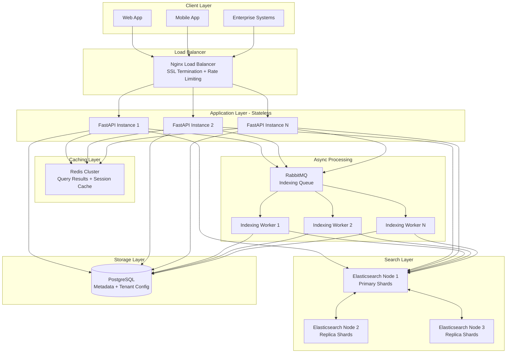
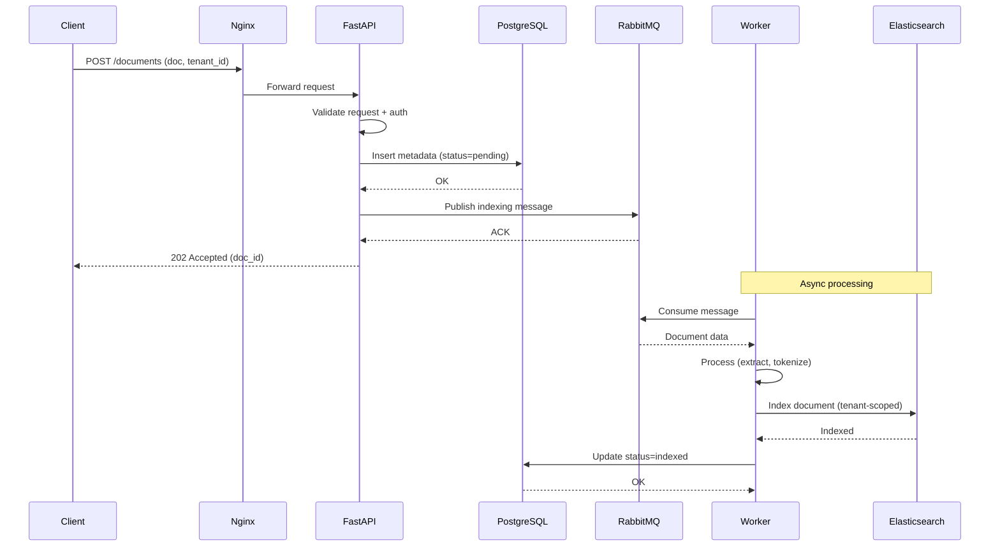
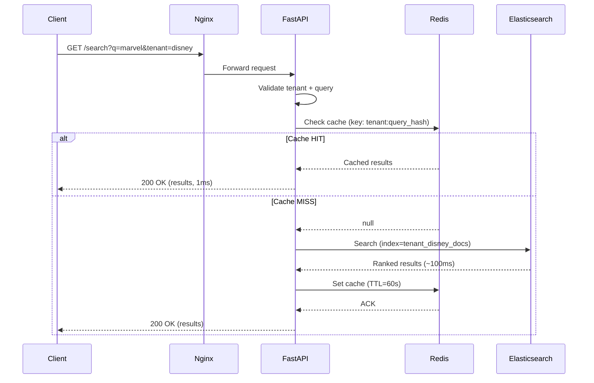

# Architecture Design Document
## Distributed Document Search Service

**Author:** Shanmukha Raj  
**Date:** July 2026  
**Version:** 1.0  

---

## 1. Overview

This document outlines the architecture of a **Distributed Document Search Service** designed to search through **10+ million documents** across multiple tenants with **sub-500ms response times** at the 95th percentile.

The system is designed to demonstrate enterprise-grade patterns including:
- **Multi-tenancy** with strict data isolation
- **Horizontal scalability** to handle growing document volumes
- **Fault tolerance** through redundancy and graceful degradation
- **High throughput** supporting 1000+ concurrent searches per second

---

## 2. System Requirements

### 2.1 Functional Requirements
- Index new documents via REST API
- Search documents with full-text search and relevance ranking
- Retrieve document details by ID
- Delete documents by ID
- Enforce tenant isolation for all operations

### 2.2 Non-Functional Requirements
| Requirement | Target |
|---|---|
| Document volume | 10+ million |
| Search latency (p95) | < 500ms |
| Throughput | 1000+ concurrent searches/sec |
| Availability | 99.95% |
| Multi-tenancy | Strict data isolation |
| Scalability | Horizontal (scale-out) |

### 2.3 Assumptions
- Documents are text-based (contracts, reports, articles, emails)
- Average document size: 10KB - 100KB
- Read-heavy workload (100 searches : 1 upload)
- Tenants are enterprise customers with 10K - 1M documents each

---
## 3. High-Level System Architecture

The system follows a **layered microservices architecture** with clear separation of concerns. Each layer can be scaled independently based on load.

### 3.1 Architecture Diagram



### 3.2 Component Responsibilities

| Component | Responsibility | Technology Choice |
|---|---|---|
| **Load Balancer** | Distributes traffic, SSL termination, rate limiting | Nginx |
| **API Layer** | Request handling, validation, authentication, orchestration | FastAPI (Python) |
| **Caching Layer** | Query result caching, session management | Redis |
| **Search Engine** | Full-text search with relevance ranking | Elasticsearch |
| **Metadata Store** | Source of truth for documents and tenant config | PostgreSQL |
| **Message Queue** | Async task processing (indexing, deletion) | RabbitMQ |
| **Workers** | Background document processing and indexing | Python (Celery) |

### 3.3 Why This Architecture?

**Stateless Application Layer**  
API servers don't store state → any request can go to any instance → easy horizontal scaling. Add more instances as traffic grows.

**Separation of Read and Write Paths**  
Read path: `API → Redis → Elasticsearch` (optimized for sub-500ms search).  
Write path: `API → RabbitMQ → Worker → Elasticsearch + PostgreSQL` (async, non-blocking).

**Independent Scaling**  
- If search traffic spikes → add more FastAPI instances and ES nodes
- If indexing backlog grows → add more workers
- If cache misses increase → add more Redis nodes

**Fault Isolation**  
If Redis crashes, the system falls back to Elasticsearch (slower but functional). If RabbitMQ crashes, uploads queue up but existing searches continue.

---
## 4. Data Flow Diagrams

The system has two primary data flows: **indexing** (write path) and **searching** (read path). Each is optimized differently — indexing prioritizes throughput via async processing, while searching prioritizes latency via caching.

### 4.1 Indexing Flow (Document Upload)

When a client uploads a document, the request is acknowledged immediately, and actual indexing happens asynchronously in the background.



**Design Rationale:**
- **Async processing** decouples upload from indexing → fast client response (<50ms)
- **PostgreSQL first** ensures we never lose a document even if RabbitMQ fails
- **Worker retries** handle transient failures (e.g., ES node restart)
- **Status tracking** allows clients to poll or subscribe to indexing completion

**Trade-off:** Documents are not immediately searchable (eventual consistency). Typical delay: 1–5 seconds. For our use case (enterprise document search), this is acceptable.

---

### 4.2 Search Flow (Query Documents)

Search requests follow the **cache-aside pattern** — check cache first, fall back to Elasticsearch, then populate cache.



**Design Rationale:**
- **Cache-aside pattern** — application controls cache logic, avoids stale writes
- **TTL of 60 seconds** — balances freshness vs cache hit ratio
- **Cache key includes tenant_id** — prevents cross-tenant data leakage
- **Query hash used as cache key** — normalizes similar queries (e.g., "MARVEL" and "marvel")

**Performance Characteristics:**
| Path | Latency (p95) | Frequency |
|---|---|---|
| Cache HIT | ~1ms | 70-80% of queries |
| Cache MISS | ~150ms | 20-30% of queries |

With a 70% cache hit ratio, the overall p95 latency stays well under 500ms.

---
## 5. Database and Storage Strategy

The system uses a **polyglot persistence** approach — different databases optimized for different workloads. This section explains each choice, alternatives considered, and trade-offs.

### 5.1 Storage Overview

| Layer | Technology | Purpose | Data Stored |
|---|---|---|---|
| **Search Engine** | Elasticsearch 8.x | Full-text search with relevance ranking | Indexed document content, metadata |
| **Metadata Store** | PostgreSQL 15+ | Source of truth, ACID guarantees | Document metadata, tenant config, audit logs |
| **Cache** | Redis 7.x | Low-latency temporary storage | Query results, rate limit counters, sessions |

### 5.2 Why Elasticsearch for Search?

**Chosen because:**
- **Built for scale**: Handles billions of documents with horizontal sharding
- **Sub-100ms latency**: Inverted index architecture designed for fast text search
- **Relevance ranking**: BM25 algorithm out of the box for ranked results
- **Distributed by design**: Automatic sharding and replication across nodes
- **Rich query DSL**: Supports fuzzy search, faceted search, highlighting, aggregations

**Alternatives considered:**

| Alternative | Why We Didn't Choose It |
|---|---|
| **PostgreSQL Full-Text Search (FTS)** | Great up to ~1M docs, but degrades at 10M+ scale. Lacks distributed sharding. |
| **MongoDB Atlas Search** | Vendor lock-in, less flexible query DSL, higher cost at scale |
| **Apache Solr** | Older technology, smaller community, more complex operations |
| **Meilisearch / Typesense** | Excellent for small-to-medium scale, but not proven at 10M+ documents with multi-tenancy |

**Elasticsearch Cluster Configuration:**
- **3 master-eligible nodes** for cluster coordination (quorum)
- **6+ data nodes** with primary + replica shards
- **Sharding**: One index per tenant (or hash-based sharding for very small tenants)
- **Replication factor**: 2 (each shard has 2 replicas for fault tolerance)

### 5.3 Why PostgreSQL for Metadata?

**Chosen because:**
- **ACID transactions**: Guarantees data integrity for critical operations
- **Rich relational model**: Supports complex tenant configurations and audit logs
- **Battle-tested at scale**: Runs mission-critical workloads at companies like Instagram, Reddit
- **Strong consistency**: Source of truth for document existence
- **JSONB support**: Flexible schema for tenant-specific configuration

**What we store:**
```sql
-- Simplified schema
CREATE TABLE documents (
    id UUID PRIMARY KEY,
    tenant_id UUID NOT NULL,
    title VARCHAR(500),
    file_path TEXT,
    status VARCHAR(20),  -- pending, indexed, deleted
    created_at TIMESTAMP,
    updated_at TIMESTAMP,
    metadata JSONB,
    INDEX idx_tenant_status (tenant_id, status)
);

CREATE TABLE tenants (
    id UUID PRIMARY KEY,
    name VARCHAR(255),
    plan VARCHAR(50),  -- free, pro, enterprise
    rate_limit INT,
    created_at TIMESTAMP
);
```

**Alternatives considered:**

| Alternative | Why We Didn't Choose It |
|---|---|
| **MongoDB** | Weaker consistency guarantees, schema flexibility not critical here |
| **DynamoDB** | Vendor lock-in (AWS), complex query patterns require careful key design |
| **MySQL** | PostgreSQL has better JSONB support and more advanced features |

### 5.4 Why Redis for Caching?

**Chosen because:**
- **In-memory speed**: Sub-millisecond latency for reads
- **Rich data structures**: Strings, hashes, lists, sorted sets, HyperLogLog
- **Pub/sub support**: Useful for cache invalidation across API instances
- **Cluster mode**: Horizontal scaling with automatic sharding
- **TTL support**: Automatic key expiration for cache management

**What we cache:**
| Cache Type | Key Format | TTL | Purpose |
|---|---|---|---|
| Search results | `search:{tenant_id}:{query_hash}` | 60s | Speed up repeated queries |
| Document metadata | `doc:{tenant_id}:{doc_id}` | 300s | Fast document retrieval |
| Rate limit counters | `ratelimit:{tenant_id}:{minute}` | 60s | Enforce rate limits |
| Tenant config | `tenant:{tenant_id}:config` | 3600s | Avoid PostgreSQL hits for config |

**Alternatives considered:**

| Alternative | Why We Didn't Choose It |
|---|---|
| **Memcached** | Simpler but lacks data structures and persistence |
| **In-memory (Python dict)** | Doesn't work with multiple API instances (each has its own cache) |
| **Hazelcast** | Enterprise-focused, higher operational complexity |

### 5.5 Data Partitioning Strategy

**Approach: Index-per-Tenant in Elasticsearch**

Each tenant gets a dedicated Elasticsearch index:
```
tenant_disney_docs
tenant_netflix_docs
tenant_spotify_docs
```

**Benefits:**
- **Strict isolation**: Impossible to accidentally query across tenants
- **Independent scaling**: Hot tenants can have more shards
- **Independent lifecycle**: Delete a tenant = delete their index (easy compliance)
- **Custom mappings**: Different tenants can have different schemas if needed

**Considerations:**
- **Small tenants**: For tenants with <10K docs, we can group them into shared indices (`shared_index_1`, `shared_index_2`) using tenant_id as a filter to avoid too many small indices
- **Very large tenants**: For tenants with >10M docs, we can shard their index across multiple ES nodes using routing keys

**PostgreSQL: Row-Level Multi-Tenancy**  
All tenants share the same tables but every row has a `tenant_id` column. Queries always include `WHERE tenant_id = ?`. This is enforced at the application layer and by Row-Level Security policies.

**Redis: Namespaced Keys**  
All Redis keys are prefixed with tenant_id (e.g., `search:tenant_disney:query_hash`). This prevents key collisions and enables per-tenant cache management.

---
